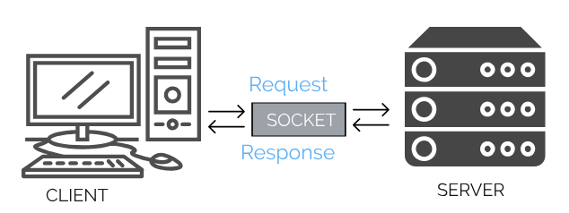

# Python-30-Days
## Day 05
### Python for Everybody-  Using Python to Access Web Data - Coursera
Today i am learning from python for everybody |  Using Python to Access Web Data | Coursera Course.
What i **learn** Today:
- TCP/IP
- Sockets

# Using Python to Access Web Data
All the class code is in [Class_Code.ipynb]('/Class_Code.ipynb') class code file is a notebook file it also includes the **assignments** with output.


# Networked Technology
## TCP/IP
**TCP/IP** stands for *Transmission Control Protocol/Internet Protocol*. TCP/IP is a set of standardized rules that allow computers to communicate on a network such as the internet.


### How do TCP and IP differ?
TCP and IP are two separate computer network protocols.
**IP** is the part that obtains the address to which data is sent. **TCP** is responsible for data delivery once that IP address has been found.

### What does TCP/IP do, exactly? And how does it work?
TCP/IP was developed by the U.S. Department of Defense to specify how computers transfer data from one device to another.

if i want to sent a message. if sent the message as a whole/one piece. if it were encounter any problem. the whole message have to be re-send. TCP/IP break each message in pacekts and those pacakets are reassemeled at end point. in fact, each packet could take a different route to the computer. if first route was unavailable or conjusted.  

## Sockets
A **Socket** is a software architecture within a network node of a computer network that serves as a end point for sending or recieving data across the network. The Structure and properties of socket are defined by API(Application programming interface).
A connection between two computers uses a socket.

**IP ADDRESS + PORT = Socket**
When a computer is runing multiple appications. Just as **IP ADDRESS** identifies a computer, the network port identifies the application/services running on that computer.

**Common TCP Ports**


### Create Socket in python
We can create a socket in 3 lines in python.
```python
#Sockets in python
import socket
mysock = socket.socket(socket.AF_INET,socket.SOCK_STREAM)
mysock.connect(('data.pr4e.org/',80))
```
