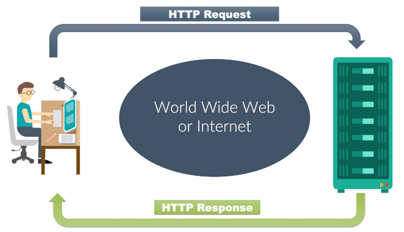

# Python-30-Days
## Day 06
### Python for Everybody-  Using Python to Access Web Data - Coursera
Today i am learning from python for everybody |  Using Python to Access Web Data | Coursera Course.
What i **learn** Today:
- What is Protocol
- HTTP
- Python Requests library

# Using Python to Access Web Data
All the class code is in [Class_Code.ipynb]('/Class_Code.ipynb') .class code file is a notebook file it also includes the **assignments** with output.


# Networked Technology
## What is Protocol
Set of rules all parties follow so we can can predict each others behavior.

## HTTP
HTTP *(hypertext transfer protocol)* is a application layer protocol for transmitting hypermedia ducments such as HTML. it was designed for communicating between web browser and web server, it also use for other purposes. HTTP follows classical server-client model. 


Everytime you click on anchor tag **a** on the website which has **href=''** link on any website to switch to the new page. it goes to to the server and issues a **GET** request to get the connect of the page at specified url. the server returns the **HTML** document to the browser which format and displays to you.


**Making a HTTP Reguest**
[Making a HTTP Reguest](img/reguest.png)

## Performing an HTTP Request
we can perform a http reguest on terminal/shell by ***telnet*** *which is built-in linux and mac but you can download on windows*
[How to Install Telnet in Windows 10](https://www.technipages.com/windows-10-enable-telnet)
```shell
telnet data.pr4e.org 80
```
```
# OUTPUT
Trying 192.241.136.170...
Connected to data.pr4e.org.
Escape character is '^]'.

<!-- You have to add this line -->
GET http://data.pr4e.org/romeo.txt HTTP/1.0

HTTP/1.1 200 OK
Date: Mon, 11 Jan 2021 12:36:40 GMT
Server: Apache/2.4.18 (Ubuntu)
Last-Modified: Sat, 13 May 2017 11:22:22 GMT
ETag: "a7-54f6609245537"
Accept-Ranges: bytes
Content-Length: 167
Cache-Control: max-age=0, no-cache, no-store, must-revalidate
Pragma: no-cache
Expires: Wed, 11 Jan 1984 05:00:00 GMT
Connection: close
Content-Type: text/plain

But soft what light through yonder window breaks
It is the east and Juliet is the sun
Arise fair sun and kill the envious moon
Who is already sick and pale with grief
Connection closed by foreign host.
```

# Performing an HTTP Request in Python
You will use a python reguest library for this and the command for doing this 
```shell
pip install requests
```
## Requests: 
Requests is a python library released under Apache2 license. the goal is to make http requests simpler and more human friendly

## Methods:
- ***requests.get(url):*** requests.get retrives the data from sepcific url
- ***r.status_code:*** status code are issued by the server in response to the user request **r** is the response object
- ***r.text:*** returns the HTML of the page  
- ***r.headers:*** return a lot of additional information containing the case insensitive name with resources types along with the server name, version, etc.

## Get and Post Data:
### Get Reguest:
```python
# Add Arguments
pload = {
    'table': 2,
    'total': 24
}
# Getting data and also adding the arguments
re = requests.get('http://httpbin.org/get',params=pload)

print(re.text)
print(re.url)
```
***Note:*** *check [Class_Code.ipynb]('/Class_Code.ipynb') which includes all the code and **assignments** with **output**.*
### Post Request:
```python
# Post data 
credientials = {
    'username': 'Sshu33',
    'password': 92983920
}
re = requests.post('https://httpbin.org/post',data=credientials)
print(re.text)
```
***Note:*** *check [Class_Code.ipynb]('/Class_Code.ipynb') which includes all the code and **assignments** with **output**.*

## Downloading and Saving an Image Using Request module
```python
python_img = requests.get('https://media.threatpost.com/wp-content/uploads/sites/103/2020/09/03105934/python2-scaled-e1599145219727.jpg')
with open('img/python_img.jpg','wb') as img:
    img.write(python_img.content)
```
**Downloaded Image:-**


# Resources:-
- [Performing an HTTP Request in Python](https://www.datacamp.com/community/tutorials/making-http-requests-in-python)
- [HTTP status codes](https://en.wikipedia.org/wiki/List_of_HTTP_status_codes)
